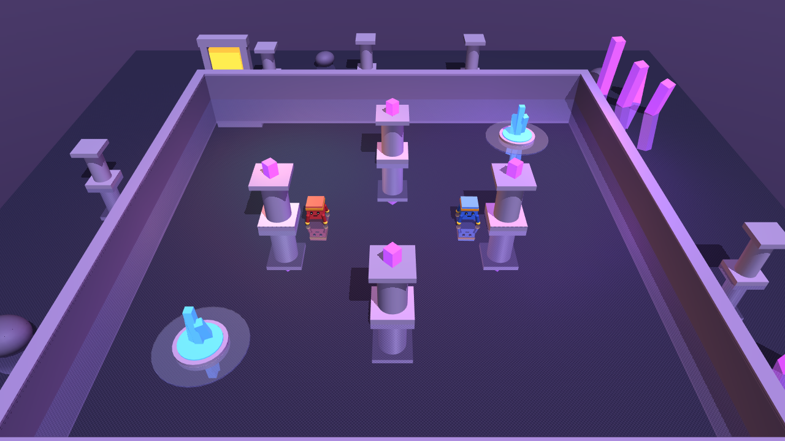
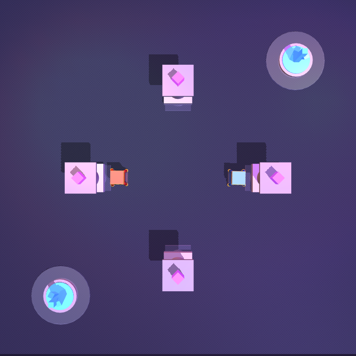

<div align="center">

# 🐕 cnu_rl_chasing

**강화학습 기반 로봇 개 추격–도망 시뮬레이션**

배터리를 가진 도망자와 추격자가 *self-play* 로 공진화하는 MuJoCo 멀티에이전트 환경
<br>· 2026 CNU Robot AI Final Term Project ·




</div>

---

## 🎯 한눈에 보기

두 마리의 큐브 로봇이 한 경기장에서 경쟁합니다.

- 🔴 **추격자(Chaser)** — 도망자를 잡거나 충전소 접근을 방해한다.
- 🔵 **도망자(Evader)** — 추격자를 피하면서, **배터리**가 떨어지기 전에 **충전소**에 도달해야 한다.

도망자는 움직일수록 배터리가 닳기 때문에 *"도망"* 과 *"에너지 관리"* 를 **동시에** 풀어야 합니다.
두 에이전트는 서로를 이기려고 번갈아 학습하며 점점 정교한 전략을 창발(arms race)합니다.

> 핵심 질문: **알고리즘의 비대칭 구성(추격자=PPO, 도망자=SAC)이 공진화와 최종 성능에 영향을 줄까?**
> 자세한 설계 배경은 **[PROJECT.md](PROJECT.md)** 참고.

### 핵심 아이디어

| | |
|---|---|
| 🔋 **배터리 생존** | 속도에 비례해 배터리 소모, 방전 시 에피소드 종료 |
| ⚡ **충전소 전략** | 충전소 선점·차단, 영역 제어, 경로 예측이 자연스럽게 창발 |
| 🧬 **공진화 self-play** | 상대를 직전 정책 스냅샷으로 고정하고 번갈아 학습 |

---

## 🚀 빠른 시작

```bash
# 1) 의존성 설치 (.venv, Python 3.12, CUDA 12.8 torch)
uv sync

# 2) 학습 없이 환경을 바로 구경하기 (무작위 정책, GUI 창)
python play.py

# 3) 비대칭 self-play 로 학습 시작 (GPU 권장)
python train.py --preset asym --rounds 10 --steps-per-round 50000 --device cuda
```

> 💡 GPU가 없으면 `--device cpu`. 처음이라면 `play.py` 로 경기장·캐릭터·충전소가 어떻게
> 생겼는지 먼저 보는 것을 추천합니다.

---

## 🗂️ 프로젝트 구조

```
cnu_rl_chasing/
├── envs/
│   ├── model_builder.py      # 두 로봇 + 아레나 + 충전소 + 장애물 MuJoCo XML 생성
│   ├── ant_chase_env.py      # 멀티에이전트 엔진 (관측/보상/종료 + ChaseConfig)
│   ├── battery_system.py     # 배터리 소모·충전 로직
│   └── multiagent_wrapper.py # PettingZoo ParallelEnv 래핑
├── agents/
│   ├── ppo_agent.py          # PPO 팩토리 (Stable-Baselines3)
│   ├── sac_agent.py          # SAC 팩토리 (Stable-Baselines3)
│   └── self_play.py          # 단일 에이전트 self-play 래퍼 + 상대 정책
├── train.py                  # self-play 공진화 학습
├── evaluate.py               # 성능 지표 평가
├── visualize.py              # 에피소드 영상(mp4/gif) 저장
├── play.py                   # MuJoCo 실시간 인터랙티브 뷰어
├── tests/                    # pytest (배터리/환경/래퍼)
└── PROJECT.md                # 프로젝트 설계 문서
```

---

## 🕹️ 사용법

### 1. 학습 — `train.py`

`--preset` 으로 세 가지 학습 구성을 선택합니다.

| preset | Chaser | Evader | 설명 |
|:------:|:------:|:------:|------|
| `ppo`  | PPO | PPO | 대칭 — 양쪽 모두 PPO |
| `sac`  | SAC | SAC | 대칭 — 양쪽 모두 SAC |
| `asym` ⭐ | **PPO** | **SAC** | **비대칭(제안)** — 추격=안정·수렴, 회피=탐험·유연 |

```bash
# 역할별 알고리즘을 직접 지정할 수도 있다
python train.py --chaser-algo sac --evader-algo ppo --rounds 10
```

> **왜 "걷기"부터?** Ant 는 (1) 걷는 법과 (2) 추격/회피를 동시에 백지에서 배워야 해서
> 학습이 느리고 "제자리 정지" 지역최적해에 잘 빠진다. 두 에이전트가 정지하면 시작 거리
> (`min_spawn_sep=4`)가 포획 거리(`catch_radius=1`)보다 커 **서로 만날 수조차 없어** 포획
> 보상을 경험하지 못한다. 그래서 **걷기를 먼저 확보**하는 것이 핵심이다. 두 가지 전략을 제공한다.

#### 전략 A — 걷기 사전학습 후 워밍스타트 (권장)

상대·배터리 없는 단일 에이전트 환경에서 "전방으로 걷기"만 먼저 학습(같은 몸·같은 관측이라
가중치 100% 호환)한 뒤, 그 가중치를 이어받아 추격/회피를 학습한다.

```bash
# 1단계: 걷기 습득 (chaser/evader walker 를 runs/walk/ 에 저장)
python pretrain_walk.py --steps 400000 --device cpu

# 2단계: 걷는 가중치를 이어받아 self-play (--init-from)
python train.py --preset ppo  --rounds 12 --steps-per-round 100000 --init-from runs/walk --tag ppo_v2  --device cpu
python train.py --preset asym --rounds 12 --steps-per-round 100000 --init-from runs/walk --tag asym_v2 --device cpu
```

#### 전략 B — Residual: 스크립트 보행 + RL 조향 (걷기 학습 불필요)

검증된 직진 보행기(open-loop CPG)를 운동 prior 로 깔고, RL 은 그 위에 더해질
**조향 잔차(residual)만** 학습한다. 즉 RL 이 "걷는 법" 대신 "어디로 틀지"만 배우면 되므로
사전학습 단계 없이도 **첫 스텝부터 이동이 보장**된다.

```bash
# 사전학습 불필요 — 보행은 스크립트가 담당, RL 은 조향만 학습
python train.py --preset ppo  --rounds 12 --steps-per-round 100000 --residual --tag ppo_res  --device cpu
python train.py --preset asym --rounds 12 --steps-per-round 100000 --residual --tag asym_res --device cpu
```

- 실제 액션 = `clip( gait(t) + residual_scale · RL_residual , -1, 1 )`, 관측에 보행 위상`[sinφ, cosφ]` 추가
- `--residual-scale`(기본 0.5)로 잔차 영향력 조절. `--residual` 은 관측 차원이 달라 `--init-from` 과 병행 불가
- 평가·뷰어(`evaluate.py`/`play.py`)는 `meta.json` 의 `residual` 플래그를 보고 자동으로 동일 방식 로드

> 비교: **A** 는 순수 RL 로 보행까지 학습(가장 일반적), **B** 는 보행을 스크립트로 보장하고 RL 부담을
> 조향으로 한정(가장 빠르고 실패 위험 낮음).

산출물은 `runs/<tag>/` 에 저장됩니다 (`tag` 는 `ppo` / `sac` / `asym_ppo_sac` 처럼 자동 생성).

```
runs/asym_ppo_sac/
├── chaser_final.zip   evader_final.zip   # 최종 모델
├── checkpoints/                          # 라운드별 체크포인트
├── history.json                          # 라운드별 평가 지표
├── meta.json                             # 역할별 알고리즘 등 구성 정보
└── tb/                                   # TensorBoard 로그
```

### 2. 평가 — `evaluate.py`

학습 디렉터리만 주면 `meta.json` 으로 역할별 알고리즘을 자동 인식합니다.

```bash
python evaluate.py --run-dir runs/asym_ppo_sac --episodes 20
```

### 3. 영상 저장 — `visualize.py`

```bash
# 카메라: topdown(전략 부감) | angle(원근) | chaser_track / evader_track(밀착 추적)
python visualize.py --run-dir runs/asym_ppo_sac --camera angle --out videos/asym.mp4

# 모델 없이 빠른 점검 (무작위 정책)
python visualize.py --episodes 2 --camera angle --out videos/demo.mp4
```

### 4. 실시간 뷰어 — `play.py`

GUI 창에서 마우스로 회전·줌 하며 직접 관전합니다.

```bash
python play.py                              # 무작위 정책 즉시 관전
python play.py --speed 2                    # 2배속
python play.py --run-dir runs/asym_ppo_sac  # 학습된 정책 관전
```

> 조작: 드래그=회전, 휠=줌, 우클릭 드래그=이동, `Space`=일시정지. 창을 닫으면 종료.

### 5. 학습 모니터링

```bash
tensorboard --logdir runs/asym_ppo_sac/tb
```

---

## ⚙️ 환경이 동작하는 방식

<table>
<tr>
<td width="55%" valign="top">

**관측 (Observation)**
- 자신의 위치·자세·속도·관절 상태
- 상대까지의 상대 위치·거리
- 가장 가까운 충전소 정보
- 가장 가까운 장애물 정보
- *(도망자)* 배터리 잔량 + 충전소 방향

**보상 (Reward)** — 계수는 `ChaseConfig`
- 추격자: 포획 `+`, 거리 `−`, 충전소 선점 `+`
- 도망자: 거리 유지 `+`, 충전 `+`, 포획·방전 `−`

**종료 (Termination)**
- 포획 / 배터리 방전 / 넘어짐 / 시간 초과

</td>
<td width="45%" valign="top">


<div align="center"><sub>topdown — 4개 기둥(장애물)과 2개 충전소</sub></div>

</td>
</tr>
</table>

**설계 포인트**
- **포획 판정**은 물리 충돌이 아니라 거리 임계값(`catch_radius`)으로 처리 → 학습 안정성 확보.
- **장애물**은 아레나 내부의 *실제 충돌 기둥* 이며, 관측에 포함되어 *뒤에 숨거나 돌아가는* 전략을 학습. `obstacle_positions=()` 로 끄면 빈 아레나.
- **공진화**는 각 에이전트를 독립 SB3 모델로 학습하고 상대는 스냅샷으로 고정해 라운드를 번갈아 진행.
- 모든 보상 계수·물리 파라미터는 **`envs.ant_chase_env.ChaseConfig`** 한 곳에서 조정.

---

## 📊 비교 지표

평가 시 PROJECT.md 의 지표를 산출합니다.

| 지표 | 의미 |
|------|------|
| 포획률 (catch rate) | 에피소드당 추격자가 도망자를 잡는 비율 |
| 생존 시간 | 도망자가 배터리를 유지하며 버틴 평균 스텝 |
| 충전 성공률 | 도망자가 충전소에 도달한 비율 |
| 방전률 | 도망자가 방전으로 종료된 비율 |
| 평균 보상 | 에이전트별 에피소드 누적 보상 |

세 구성(`ppo` / `sac` / `asym`)의 `runs/<tag>/history.json` 을 비교해 가설을 검증합니다.

---

## 📚 참고 문헌

- Schulman et al., *Proximal Policy Optimization Algorithms*, 2017
- Haarnoja et al., *Soft Actor-Critic*, 2018
- Baker et al., *Emergent Tool Use From Multi-Agent Autocurricula*, 2019
- Terry et al., *PettingZoo: Gym for Multi-Agent RL*, 2021
- Bansal et al., *Emergent Complexity via Multi-Agent Competition*, 2018

## 📄 License

MIT License — see [LICENSE](LICENSE).
